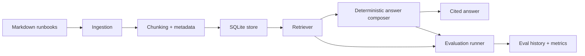

# AI Reliability Lab

I built this as a small production-style lab for testing how a RAG system behaves after
it moves past the demo stage. The corpus is MLOps documentation: release runbooks,
monitoring notes, incident response, and evaluation guidance.

The goal is not to claim this is a full enterprise platform. The goal is to show the
engineering pieces I care about in real AI systems: ingestion, retrieval, grounded
answers, evals, observability, repeatable setup, and clear failure modes.

## What It Does

- Ingests local Markdown runbooks into SQLite.
- Chunks documents with source and heading metadata.
- Retrieves relevant context with deterministic lexical scoring.
- Answers questions with citations from the retrieved chunks.
- Refuses when the corpus does not contain enough evidence.
- Runs a small evaluation suite for grounding and refusal behavior.
- Records query latency, retrieved sources, eval runs, and recent failures.
- Runs locally without an API key.

## Why This Shape

Most RAG projects stop at "chat with docs." I wanted this to look closer to the way I
think about MLOps work:

- Can I reproduce it from a clean machine?
- Can I test the behavior without a paid API?
- Can I see what evidence the answer used?
- Can I run regression evals after changing retrieval or prompts?
- Can I explain what failed and what I would improve next?

## Architecture



## Quickstart

```bash
python3 -m venv .venv
. .venv/bin/activate
python -m pip install -e ".[dev]"
pytest
uvicorn ai_reliability_lab.app:app --reload
```

In another terminal:

```bash
curl -X POST http://127.0.0.1:8000/ingest
curl -X POST http://127.0.0.1:8000/query \
  -H "Content-Type: application/json" \
  -d '{"question":"How should I roll back a model release?","limit":3}'
curl -X POST http://127.0.0.1:8000/eval/run
curl http://127.0.0.1:8000/metrics/summary
```

## CLI Demo

The same workflow can run from the terminal:

```bash
ai-lab ingest
ai-lab query "How should I roll back a model release?"
ai-lab eval --format markdown
ai-lab metrics
```

You can point the lab at another corpus or database without changing code:

```bash
LAB_CORPUS_DIR=data/corpus LAB_DATABASE_PATH=data/runtime/lab.db ai-lab ingest
```

## Docker

```bash
docker build -t ai-reliability-lab .
docker run --rm -p 8000:8000 ai-reliability-lab
```

## API

- `GET /health` reports service, database, document, and chunk status.
- `POST /ingest` ingests the local Markdown corpus.
- `POST /query` returns an answer, citations, retrieved chunks, latency, and diagnostics.
- `POST /eval/run` runs the grounding/refusal evaluation suite.
- `GET /metrics/summary` returns query count, eval count, average latency, and recent failures.

## Interview Notes

The part I would talk through in an interview is the tradeoff between simple,
deterministic behavior and production realism. I intentionally started with local
retrieval and a deterministic answer composer so tests can prove behavior without an
external model. The provider boundary is where I would add a hosted LLM provider, a local
model, or a reranker later.

The most important design decision is that every answer carries evidence. If retrieval
does not find evidence, the system refuses instead of filling the gap with a confident
guess. That is the reliability habit I want in any AI system I own.

## More Detail

- [Architecture](docs/architecture.md)
- [Case Study](docs/case-study.md)
- [Demo Walkthrough](docs/demo.md)
- [Evaluation](docs/evaluation.md)
- [Interview Guide](docs/interview-guide.md)
- [Note: What I Learned Building Evals Before Adding an LLM](docs/notes/evals-before-llms.md)
- [Roadmap](docs/roadmap.md)
