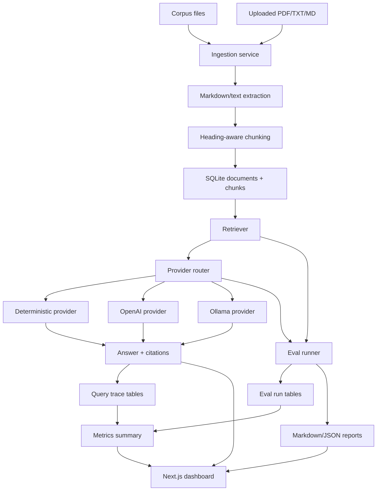

# Architecture

This platform is organized around the reliability questions I care about in AI systems:
what evidence was used, which provider answered, what changed after a retrieval tweak,
and whether unsupported questions are refused.

## System Flow

## Module Boundaries

- `config` reads local paths and optional provider settings from environment variables.
- `chunking` turns documents into stable chunks with source and heading metadata.
- `ingestion` discovers corpus files, extracts upload text, computes checksums, and
  replaces document chunks idempotently.
- `retrieval` ranks chunks and exposes matched-term diagnostics.
- `providers` owns the deterministic baseline plus optional OpenAI and Ollama adapters.
- `evaluation` runs repeatable grounding and refusal checks.
- `reporting` writes human-readable Markdown and machine-readable JSON eval artifacts.
- `storage` owns SQLite schema, migrations, trace persistence, and metrics summaries.
- `app` exposes the FastAPI routes used by the dashboard and CLI workflows.
- `frontend` provides the operational console.

## Persistence

SQLite stores four kinds of state:

- Corpus state: `documents`, `chunks`
- Query state: `query_traces`, `retrieval_traces`, `answer_citations`
- Legacy compatibility: `query_logs`
- Evaluation state: `eval_runs`

The schema is created locally and includes migrations for older database shapes. That
matters because I want the project to survive real iteration, not only pass tests on an
empty database.

## Provider Boundary

The provider router has one requirement: given a question and retrieved chunks, return an
answer object with citations, coverage, refusal state, latency, model name, warnings, and
estimated cost. The deterministic provider is always enabled. OpenAI and Ollama are
enabled only when their environment settings are present.

This keeps the expensive or nondeterministic part isolated. I can improve retrieval,
tracing, evals, and the dashboard without needing an API key.

## Design Tradeoffs

I chose SQLite because it is easy to inspect, reliable for a local portfolio project, and
good enough to show persistence and observability. A production version would likely move
retrieval to hybrid search or a vector database, but the rest of the system boundaries
would stay similar.

The default retriever is lexical by design. It makes ranking behavior explainable and
testable. Embeddings and reranking belong behind the same retrieval contract so they can
be compared through evals instead of assumed to be better.

The deterministic provider is not pretending to be a powerful LLM. It is the control
group: stable behavior, no key, repeatable tests, and reliable demos. Real LLM providers
are optional experiments layered on top of the same evidence and trace path.

## Failure Modes

- Retrieval returns the wrong runbook section.
- The answer uses evidence but drops citations.
- The provider answers when the corpus has no evidence.
- A provider refuses too aggressively and misses valid evidence.
- A database migration works on a fresh DB but fails on an existing DB.
- Eval reports are generated but not visible in the operational workflow.
- Dashboard metrics look healthy while recent failures are hidden.

The implementation is shaped so these failures are visible through tests, eval reports,
query traces, and dashboard state.
