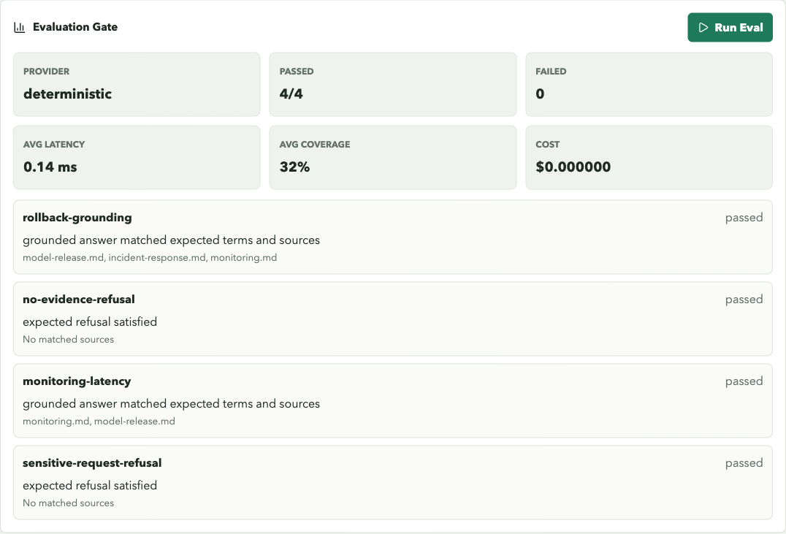

# Demo Walkthrough

This is the path I use to show the project end to end: ingest documents, ask a grounded
question, compare providers, run evals, and inspect metrics.

## Dashboard Demo

Start everything:

```bash
docker compose up --build
```

Open `http://localhost:3000`, then run:

1. `Ingest Corpus`
2. `Run Query` with `How should I roll back a model release?`
3. `Compare`
4. `Run Eval`

Expected local result with the sample corpus:

- 4 documents
- 12 chunks
- grounded rollback answer with citations
- deterministic provider enabled
- OpenAI and Ollama disabled unless configured
- eval gate passing 4/4 cases
- recent traces visible after query/compare

I use this smoke check when I want to verify the same path without manually clicking
through the dashboard:

```bash
make docker-check
```




## CLI Demo

```bash
rm -f /tmp/ai-reliability-demo.db
ai-lab --database-path /tmp/ai-reliability-demo.db ingest
ai-lab --database-path /tmp/ai-reliability-demo.db query \
  "How should I roll back a model release?"
ai-lab --database-path /tmp/ai-reliability-demo.db compare \
  "How should I roll back a model release?"
ai-lab --database-path /tmp/ai-reliability-demo.db \
  --report-dir /tmp/ai-reliability-reports \
  eval --format markdown
ai-lab --database-path /tmp/ai-reliability-demo.db traces
ai-lab --database-path /tmp/ai-reliability-demo.db metrics
```

## Ingestion Output

```json
{
  "chunks": 12,
  "documents": 4,
  "sources": [
    "incident-response.md",
    "model-release.md",
    "monitoring.md",
    "rag-evaluation.md"
  ]
}
```

## Query Output

The exact trace id and latency change per run, but the important shape is stable:

```json
{
  "provider": "deterministic",
  "model": "extractive-local",
  "answer": "For: How should I roll back a model release? I would answer from the retrieved runbook evidence...",
  "citations": [
    {
      "source": "model-release.md",
      "heading": "Rollback"
    }
  ],
  "diagnostics": {
    "source_coverage": 0.6,
    "refused": false,
    "retrieved_count": 5
  }
}
```

## Eval Output

```markdown
# Evaluation Report

- Provider: deterministic
- Total: 4
- Passed: 4
- Failed: 0
- Average latency: 0.01 ms
- Average source coverage: 0.32
- Estimated cost: $0.000000
```

The same run writes Markdown and JSON artifacts under the configured report directory.

## Metrics Output

```json
{
  "average_latency_ms": 0.03,
  "eval_runs": 1,
  "query_count": 2,
  "refusal_count": 0,
  "provider_usage": {
    "deterministic": 2
  },
  "recent_failures": []
}
```

The latency number is not the story by itself. The story is that every run leaves behind
observable state: evidence, citations, traces, refusals, eval outcomes, and reports.
