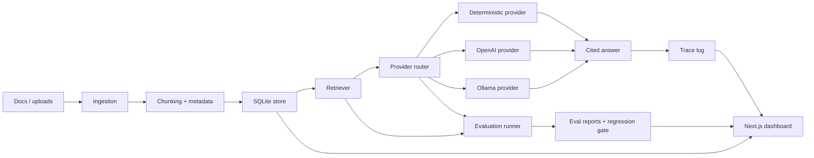

# AI Reliability Platform Design

## Goal

Turn `ai-reliability-lab` into one end-to-end flagship project for reliable RAG and
agent-style AI workflows. The project should be easy to run locally, strong enough to
discuss in senior AI/MLOps interviews, and honest about what it proves: ingestion,
retrieval, grounded answering, provider comparison, evaluation, observability, regression
gates, and a usable dashboard.

## Product Positioning

This is not a basic "chat with docs" demo. The project is a reliability platform for
RAG systems:

- It ingests a controlled documentation corpus.
- It retrieves evidence and answers with citations.
- It refuses unsupported or unsafe requests.
- It runs repeatable evaluations across retrieval, groundedness, refusal behavior,
  latency, and provider cost.
- It records query traces and provider traces so failures can be inspected.
- It exposes a dashboard for operators to review answers, evidence, eval history,
  failure cases, and system metrics.

The portfolio story is: "I built this to understand how RAG systems move from a demo to
a measurable, observable, regression-tested AI product."

## Scope

The first completed version will be a showcase-grade local platform, not a cloud-only
deployment. It must run from a fresh clone using Docker Compose and must also support a
plain Python/Node local development path.

In scope:

- FastAPI backend.
- SQLite persistence.
- Next.js dashboard inside the same repo.
- Local deterministic provider that needs no API key.
- Optional OpenAI provider.
- Optional Ollama provider.
- Provider comparison for the same query and eval cases.
- Markdown/TXT/PDF upload path.
- Sample MLOps and AI governance corpus.
- Query traces, retrieved chunks, citations, answer diagnostics, and eval reports.
- Metrics summary for query count, eval count, latency, refusal rate, provider usage,
  estimated cost, and recent failures.
- Regression gate command for local verification.
- Docker Compose for backend and frontend.
- Static screenshots and interview-ready docs after implementation.

Out of scope for this first flagship pass:

- Real user accounts.
- Multi-tenant authorization.
- Hosted production deployment.
- Fake adoption, fake traffic, fake customer claims, or fake performance numbers.
- Heavy enterprise infrastructure that makes the project hard to run locally.

## Architecture

The system will keep the existing Python package as the backend core and add a first-class
dashboard from the useful parts of `applied-ai-eval-lab`.

## Backend Components

### API Layer

The backend remains FastAPI and exposes a stable public API:

- `GET /health`
- `POST /ingest`
- `GET /documents`
- `POST /documents/upload`
- `POST /query`
- `POST /query/compare`
- `POST /eval/run`
- `POST /eval/compare`
- `GET /traces`
- `GET /traces/{trace_id}`
- `GET /metrics/summary`
- `GET /reports`

The existing `/ingest`, `/query`, `/eval/run`, and `/metrics/summary` endpoints stay
compatible where possible so current tests and CLI flows remain meaningful.

### Persistence

SQLite stays as the local persistence layer because it makes the project easy to clone
and inspect. The schema expands from documents/chunks/query logs/eval runs into:

- `documents`: source, title, checksum, type, metadata, ingested time.
- `chunks`: chunk id, document id/source, heading, text, ordinal, token count.
- `query_traces`: trace id, question, provider, latency, estimated cost, refusal,
  confidence, created time.
- `retrieval_traces`: trace id, chunk id, rank, score, source, heading.
- `answer_citations`: trace id, citation id, chunk id, quote, source, heading.
- `eval_runs`: run id, provider, total, passed, failed, metrics, report JSON.
- `eval_items`: run id, case id, question, passed, failure category, evidence coverage,
  latency, answer excerpt.

### Retrieval

The first implementation keeps deterministic local retrieval as the default baseline and
adds better diagnostics around it:

- token-based lexical scoring already present in the repo,
- ranked retrieved chunks,
- source coverage,
- score distribution,
- top-k configuration.

The design leaves room for future embedding/vector retrieval without making the first
flagship depend on heavyweight local model downloads.

### Provider Layer

The answer layer becomes a provider interface:

- `deterministic`: current extractive/cited composer, always available.
- `openai`: optional provider enabled by `OPENAI_API_KEY`.
- `ollama`: optional local provider enabled by `OLLAMA_BASE_URL` and model name.

All providers return the same shape:

- answer text,
- citations,
- refusal flag,
- provider metadata,
- latency,
- estimated cost when applicable,
- warnings if the answer contains unsupported claims.

The deterministic provider is the default. Real providers are optional and must never be
required for tests or the core demo.

### Evaluation

The evaluation runner measures behavior that matters for RAG reliability:

- retrieval hit rate,
- citation coverage,
- answer groundedness,
- refusal correctness,
- unsupported-answer detection,
- latency,
- estimated cost,
- provider comparison.

Eval cases include:

- normal MLOps runbook questions,
- unsupported questions,
- prompt-injection style requests,
- sensitive-data requests,
- ambiguous questions that require multiple chunks.

Eval reports are saved to SQLite and exported as Markdown/JSON artifacts so a reviewer
can inspect what changed between runs.

### Regression Gate

`make verify` remains the top-level command and grows into a release gate:

- lint,
- backend tests,
- frontend typecheck/build,
- API smoke flow,
- CLI smoke flow,
- deterministic eval run,
- regression thresholds.

The regression thresholds for deterministic mode:

- eval pass rate must be 100% for the curated local set,
- refusal cases must pass,
- query flow must produce at least one citation for supported questions,
- metrics endpoint must report the query and eval run,
- no API key can be required.

## Frontend Dashboard

The dashboard moves into `ai-reliability-lab/frontend` and becomes the main visual
experience for the flagship.

Primary views:

- **Workspace:** document list, ingest/index actions, upload path, corpus status.
- **Ask:** question input, provider selector, answer, citations, retrieved evidence.
- **Compare:** run the same question across deterministic/OpenAI/Ollama where configured.
- **Evaluations:** run evals, compare providers, inspect pass/fail cases.
- **Traces:** inspect query trace details: retrieval scores, citations, provider latency,
  cost, refusal, and warnings.
- **Metrics:** query counts, eval counts, latency, refusal rate, provider usage, recent
  failures.

The dashboard should feel like an operational tool, not a marketing page. It should be
dense, readable, and built for repeated inspection.

## CLI

The existing `ai-lab` CLI remains and gains commands that mirror the dashboard:

- `ai-lab ingest`
- `ai-lab query "..."`
- `ai-lab compare "..."`
- `ai-lab eval`
- `ai-lab traces`
- `ai-lab metrics`
- `ai-lab report --latest`

The CLI is important because it proves the backend works without the browser.

## Configuration

Configuration uses environment variables with safe defaults:

- `LAB_DATABASE_PATH`
- `LAB_CORPUS_DIR`
- `LAB_DEFAULT_PROVIDER=deterministic`
- `OPENAI_API_KEY`
- `OPENAI_MODEL`
- `OLLAMA_BASE_URL`
- `OLLAMA_MODEL`
- `LAB_EVAL_REPORT_DIR`

`.env.example` documents safe values only. Real secrets stay out of git.

## Docker Compose

Docker Compose runs:

- backend on `http://localhost:8000`,
- frontend on `http://localhost:3000`,
- shared local volume for SQLite and generated reports.

No external service is required for the default demo.

## Testing Strategy

Backend tests:

- chunking,
- ingestion idempotency,
- retrieval ranking,
- provider interface,
- deterministic provider refusal/citation behavior,
- optional-provider disabled behavior,
- query trace persistence,
- eval scoring,
- metrics summary,
- API response shapes.

Frontend tests/checks:

- typecheck,
- production build,
- dashboard API contract assumptions,
- no hardcoded secrets,
- demo/empty/error states.

End-to-end local verification:

- start backend against a temporary database,
- ingest sample corpus,
- run a supported query,
- run an unsupported query,
- run deterministic eval,
- confirm metrics and traces.

## Documentation

Public docs should read as confident engineering documentation, not apologies:

- README with one-command local run, architecture, dashboard screenshots, API examples,
  and interview talking points.
- `docs/architecture.md` for system design.
- `docs/evaluation.md` for eval methodology.
- `docs/providers.md` for deterministic/OpenAI/Ollama behavior.
- `docs/observability.md` for traces and metrics.
- `docs/demo.md` for a real end-to-end demo path.
- `docs/verification.md` with current local verification output.
- `docs/roadmap.md` with honest next steps.

The README should avoid language that makes the project sound unfinished. It should frame
the project as a local-first reliability platform while still avoiding fake
production/adoption claims.

## Success Criteria

The project is complete for this flagship pass when:

- A fresh clone can run `docker compose up --build`.
- Backend is available at `http://localhost:8000`.
- Frontend is available at `http://localhost:3000`.
- User can ingest the sample corpus from the dashboard.
- User can ask a supported question and see answer, citations, retrieved chunks, trace,
  latency, and provider.
- User can ask an unsupported/sensitive question and see a refusal.
- User can run evals and inspect pass/fail cases.
- User can compare deterministic mode with any configured optional provider.
- `make verify` passes without API keys.
- Docs explain the architecture, eval design, provider design, and demo path.
- Portfolio/profile links point to this as the primary AI reliability flagship.
